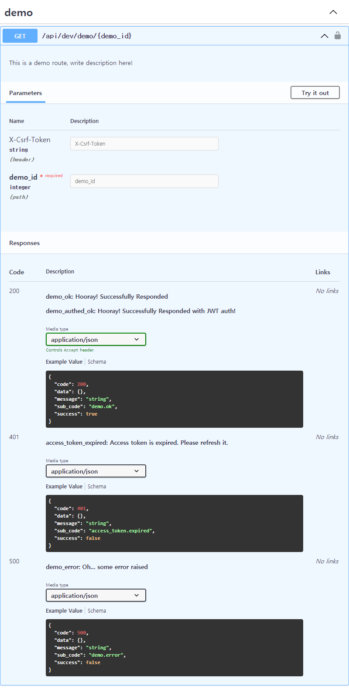

# FROST backend template
> ***F***lask based  
  ***R***est-API  
  ***O***riented  
  ***S***erver  
  ***T***emplate

FROST is a flask template that supports various built-in functions, such as...  

- JWT authentication  
- Flask-Admin authentication  
- Manual Token Revoke ablilty  
- Request input verification  
- OpenAPI 3.0 YAML document generation  
- ER Diagram generation  
- EMail address verification and password reset  

and more!  

## Usage
1. Create `demo` on directory on app/api, create `__init__.py` and write below
```PYTHON
import flask
import flask.views
import typing

import app.api.helper_class as api_class
import app.database.jwt as jwt_module


class DemoResponseCase(api_class.ResponseCaseCollector):
    demo_ok = api_class.Response(
        description='Hooray! Successfully Responded',
        code=200, success=True,
        public_sub_code='demo.ok')

    demo_authed_ok = api_class.Response(
        description='Hooray! Successfully Responded with JWT auth!',
        code=200, success=True,
        public_sub_code='demo.authed_ok')

    demo_error = api_class.Response(
        description='Oh... some error raised',
        code=500, success=False,
        private_sub_code='demo.some_serious_error',
        public_sub_code='demo.error')


class DemoRoute(flask.views.MethodView, api_class.MethodViewMixin):
    @api_class.RequestHeader(
        # AuthType.Bearer: False means that access token authorization is not compulsory.
        # If you set this to True, then access token must be given.
        # Or, you can leave auth parameter as blank if you don't need any authorizations on this route.
        auth={api_class.AuthType.Bearer: False, })
    def get(self,
            demo_id: int,
            req_header: dict,
            access_token: typing.Optional[jwt_module.AccessToken] = None):
        '''
        description: This is a demo route, write description here!
        responses:
            - demo_ok
            - demo_authed_ok
            - demo_error
        '''
        if access_token:
            return DemoResponseCase.demo_authed_ok.create_response()

        if demo_id % 2:
            return DemoResponseCase.demo_error.create_response()

        return DemoResponseCase.demo_ok.create_response(data=req_header)
```
2. Add these lines on `app/api/project_route.py`
```PYTHON
import app.api.demo as route_demo  # noqa
project_resource_routes['/demo/<int:demo_id>'] = route_demo.DemoRoute
```
3. Good! You just created a new route!  
Test this route using `curl {your_domain}/api/dev/demo/42`

4. You can create a OpenAPI 3.0 document using `flask create-openapi-doc`. [See Tools section  below](#Tools)  


## Setup & Run
### Setup
#### Windows
```POWERSHELL
# Create your project using this template repository on Github
cd {YOUR-PROJECT-DIRECTORY}
python -m venv ./
./Scripts/activate
python -m pip install -U -r "requirements-dev.txt"
```
Copy and paste this to Powershell.  
You have to install `git for windows` and `Python3.9 (or above)` to run these commands

#### Debian based(Ubuntu/Linux Mint/etc.)
```BASH
# Create your project using this template repository on Github
cd {YOUR-PROJECT-DIRECTORY}
python3.9 -m venv ./
source ./bin/activate
python3.9 -m pip install -U -r "requirements-dev.txt"
```
Copy and paste this to Bash shell.  
You also needs `git`, `python3.9`, `python3.9-pip`, `python3.9-venv` to run these commands.

### Environment variables
Before you run, you have to set environment variables. Notes that some variables are from Flask configuration, see [Flask document](https://flask.palletsprojects.com/en/master/config/) And there's a tool named `env_creator.py` on `env_collection` directory. This will create `.sh`(bash shell script), `.ps1`(Powershell script), and `.vscode/launch.json`(VS Code Configuration file for launch) files that set environment variables when being executed.
Modify `dev.json` file properly and pass the file as cli argument.(About cli tool, [See Tools section below](#Tools))  
ex) `python3.9 ./env_collection/env_creator.py ./env_collection/dev.json`

Key                    | Required | Explain
| :----:               |  :----:  | :----
`PROJECT_NAME`         | O | This will be shown on automatically created documents or some server-rendered pages.
`BACKEND_NAME`         |   | Set `Server` field on response header. `Backend Core` is default
`SERVER_NAME`          | O | Same as Flask's `SERVER_NAME`. Set domain name here.
`HTTPS_ENABLE`         |   | If `HTTPS_ENABLE` env var is `false`, then `secure` option on cookie will be disabled. Default value is `true` and will be disabled only when the value is set to `false`
`HOST`                 |   | Host address while running `flask run`.
`PORT`                 |   | Port number for the API server. `PORT` environment variable also works with Gunicorn, see https://docs.gunicorn.org/en/stable/settings.html#bind
`SECRET_KEY`           | O | Secret key used in JWT, some builtin functions in flask, etc. Random string will be applied if not set. This is same as Flask's `SECRET_KEY`
`LOG_FILE_ENABLE`      |   | Creates log file. Defaul value is `false`
`LOG_FILE_NAME`        |   | Sets log file name. `SERVER_NAME`.log will be used when not set.
`LOG_FILE_LEVEL`       |   | Sets log level. Can be `CRITICAL`, `FATAL`, `ERROR`, `WARN` or `WARNING`, `INFO`, `DEBUG`, and `NOTSET`.
`DEVELOPMENT_KEY`      |   | If `RESTAPI_VERSION` env var is `dev` and this value is set, then only request that contains same string as `X-Development-Key` in header will be allowed.
`LOCAL_DEV_CLIENT_PORT`|   | If `RESTAPI_VERSION` env var is `dev` and this value is set, then CORS header for `http://localhost:{LOCAL_DEV_CLIENT_PORT}` will be set. You must set this as integer string.
`SERVER_IS_ON_PROXY`   |   | When this variable is set, then frost enables ***Werkzeug's X-Forwarded-For Proxy Fix*** so that Flask can get correct address of request when application is behind a reverse proxy.<br>MUST ENABLE THIS ONLY IF THIS APPLICATION IS BEHIND A REVERSE PROXY! (security issues) See https://werkzeug.palletsprojects.com/en/latest/middleware/proxy_fix/ or https://github.com/pallets/werkzeug/blob/main/src/werkzeug/middleware/proxy_fix.py
`X_FOR_LEVEL`          |   | X_FOR_LEVEL is a value for werkzeug.middleware.proxy_fix.ProxyFix's argument.
`X_PROTO_LEVEL`        |   | X_PROTO_LEVEL is a value for werkzeug.middleware.proxy_fix.ProxyFix's argument.
`X_HOST_LEVEL`         |   | X_HOST_LEVEL is a value for werkzeug.middleware.proxy_fix.ProxyFix's argument.
`X_PORT_LEVEL`         |   | X_PORT_LEVEL is a value for werkzeug.middleware.proxy_fix.ProxyFix's argument.
`X_PREFIX_LEVEL`       |   | X_PREFIX_LEVEL is a value for werkzeug.middleware.proxy_fix.ProxyFix's argument.
`FLASK_APP`            | O | Same as Flask's `FLASK_APP`. You must set this to `app`.
`FLASK_ENV`            | O | Same as Flask's `FLASK_ENV`.
`RESTAPI_VERSION`      | O | This value will be included in route URL. `dev` if not set.<br>ex) `api/dev/account/login` if `dev` set, `api/v2/posts/123456` if `v2` set.
`ACCOUNT_ROUTE_ENABLE` |   | Enable account related routes, such as sign-up, sign-in, email-action, etc. Default value is `true` and will be disabled only when the value is set to `false`
`FILE_MANAGEMENT_ROUTE_ENABLE`            |   | Enable file management routes, such as file upload/delete, etc.
`FILE_UPLOAD_ALLOW_EXTENSION`             |   | Set allowed extension list while uploading file. Default value contains allowed image format extensions on web. 
`FILE_UPLOAD_IMAGE_WEB_FRIENDLY_CHECK`    |   | Check uploaded image is web-friendly. 
`DROP_ALL_REFRESH_TOKEN_ON_LOAD`          |   | Drop all refresh tokens on load when `RESTAPI_VERSION` is `dev`, such as start-up or auto reload by werkzeug debugger. Default value is `true` and will be disabled only when the value is set to `false`
`DB_URL`               | O | Database URL to connect, `sqlite:///:memory:` if not set on `RESTAPI_VERSION = dev`.
`REDIS_HOST`           | O | Hostname of Redis database.
`REDIS_PORT`           | O | Port of Redis database. You must set this as integer string.
`REDIS_DB`             | O | DB number of Redis database. You must set this as integer string.
`REDIS_PASSWORD`       |   | Password of Redis database. You don't need to set this when there's no password on Redis.
`MAIL_ENABLE`          |   | This enables email ability, like register confirmation mail. Enabled by default. This will be disabled only when the value is set to `false`
`MAIL_PROVIDER`        | O | Set mail provider. Value can be `AMAZON` or `GOOGLE`. Default value is `AMAZON`. This value is not required when MAIL_ENABLE is `false`.
`MAIL_DOMAIN`          |   | Set mail domain here.
`SIGNIN_POSSIBLE_AFTER_MAIL_VERIFICATION` |   | This blocks user from signing in when user didn't do email verification, but this will be not applied on first user as first account's `email_verified` will be set to `true` when signing up. Enabled by default. This will be disabled when this field or `MAIL_ENABLE` field is set to `false`.
`GOOGLE_CLIENT_ID`     |   | Set this when you use Google as mail provider.
`GOOGLE_CLIENT_SECRET` |   | Set this when you use Google as mail provider.
`GOOGLE_REFRESH_TOKEN` |   | Set this when you use Google as mail provider.

### Run
Run server with ```python -m flask run``` on Windows, or ```python3.9 -m flask run``` on Linux.  


## Tools

Frost has some development tools. Notes that server environment variables must be set to run these tools, because these tools need initialized flask app contexts.  
Usage:
> `flask create-openapi-doc`  
  `flask draw-db-erd`  
  `flask drop-db`

  - create-openapi-doc  
This creates OpenAPI document that is represented in YAML format. You can see rendered document using [Swagger UI](https://swagger.io/tools/swagger-ui/)
  - draw-db-erd  
This draws Entity Relationship Diagram as a dot file. To render dot file as a image(such as .png,.jpg, etc), run `dot -Tpng input.dot > output.png` on linux. (You need to install dot)
  - drop-db  
This drops all tables on DB. Works only when `RESTAPI_VERSION` environment variable is set to `dev`.


## Coding convension
  - Max line length to `120`
